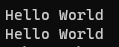

# C-project
## C언어의 특징
- 간결한 언어
- 효율적인 언어
- 저수준의 프로그래밍도 가능하고 고수준의 프로그래밍도 가능
- 이식성이 뛰어난 언어

## 임베디드 시스템
특수 목적의 시스템입니다.

예) 스마트폰, 교통신호 제어 시스템, 자동차, 카메라 등

## Hello World 출력하기
```c
#include <stdio.h>
int main(void) {
	printf("Hello World");
	return 0;
}
```
### 코드 설명
```
#include <stdio.h>
-> 설명
	#: 전처리기 기호
	전처리기는 컴파일하기 전에 사전 정지 작업을 하는 컴파일러의 일부분 입니다.
	#include는 소스코드 안에 특정 파일을 현재 위치에 포함시키라는 뜻입니다.
	이러한 파일은 헤더파일이라고 합니다.
	stdio.h 파일은 입출력 함수의 정보를 가지고 있는 헤더 파일입니다.

int main(void) {
-> 설명
	int main(void) {}는 main()함수를 정의하는 문장입니다.
	함수는 특정 작업을 수행하기 위하여 작성된 독립적인 코드입니다.
	int는 함수가 출력하는 값의 타입입니다. int는 정수를 뜻합니다.
	main()함수는 C 프로그램에서 가장 처음 실행되는 부분이라 C프로그램은 하나의 main()함수가 반드시 있어야 합니다.
	void는 비어있다는 의미로 함수의 입력값이 없다는 뜻입니다.
	int와 void같은 용어를 예약어(또는 키워드)라고 합니다.

	printf("Hello World");
-> 설명
	printf()는 출력함수를 뜻합니다.
	()안에 출력할 값을 넣어줍니다.
	위의 처럼 문자열(string)을 출력할 때는 "" 혹은 ''를 사용합니다.

	return 0;
-> 설명
	return은 함수가 작업을 끝내고 결과를 반환할 때 사용합니다.
	0의 값은 프로그램이 정상적으로 종료했음을 뜻합니다.

	추가로 문장 뒤에는 항상 세미콜론 ; 을 붙여야 합니다.
}
```

## 여러 줄 출력하기
```c
#include <stdio.h>
int main(void) {
	printf("Hello World\n");
	printf("Hello World");
	return 0;
}
```
여러 줄을 출력할 때는 `\n`기호를 사용합니다.


## 간단한 계산해보기
```c
#include <stdio.h>
int main() {
	// 간단한 계산 해보기
	printf("1 + 1 = %d\n", 1 + 1);
	printf("2 - 2 = %d\n", 2 - 2);
	printf("3 * 3 = %d\n", 3 * 3);
	printf("4 / 4 = %d\n", 4 / 4);
	printf("4 %% 4 = %d", 4 % 4);
	return 0;
}
```
### 코드 설명
```
// 간단한 계산 해보기
-> 설명
	//는 주석 기호입니다.
printf("1 + 1 = %d\n", 1 + 1);
-> 설명
	"1+1=%d"는 문자열로 1+1= 을 출력하고
	뒤의 %d는 정수를 출력할 때 사용하는 형식 지정자 입니다.
printf("2 - 2 = %d\n", 2 - 2);
printf("3 * 3 = %d\n", 3 * 3);
printf("4 / 4 = %d\n", 4 / 4);
-> 설명
	나눈 몫 출력
printf("4 %% 4 = %d", 4 % 4);
-> 설명
	나눈 나머지 출력
```